# Build a Language Translation Bot using Amazon Lex

In this project, I built a language translation chatbot using Amazon Lex. If you want to translate a word or sentence into another language, simply type it into the chatbot — and it will output the translation.

---

### Project Architecture

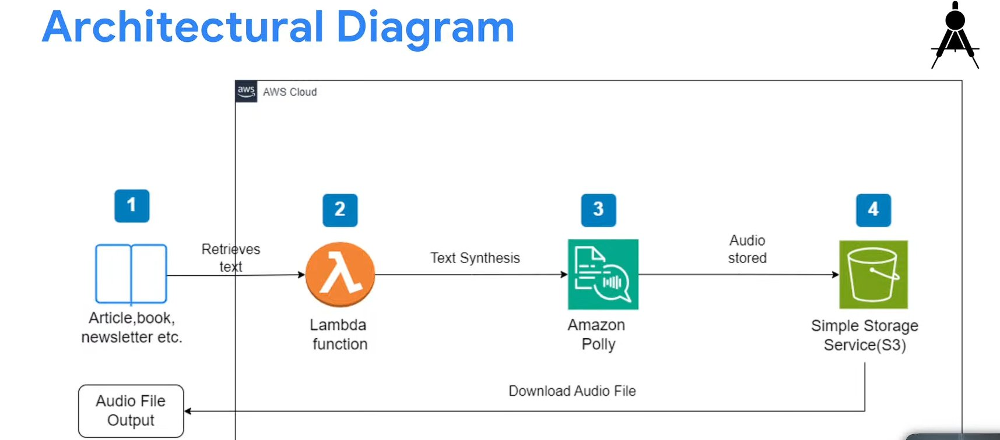

---

### Services Used 🛠

* **Amazon Lex** — Build the chatbot (`TextTranslator`) and define conversation flow with intents, utterances, and slots.
* **AWS Lambda** — Handles the translation logic via the `TranslateBot` function.
* **AWS IAM** — Manages secure access using the `lambdabotrole` custom execution role with `TranslateFullAccess` and `AWSLambdaBasicExecutionRole` policies.
* **Amazon Translate** — Performs the actual translation based on the target language specified by the user.

---

### Steps Followed 📋

1. **Created the bot** — Set up a new bot named `TextTranslator` in Amazon Lex with English (US) language.

   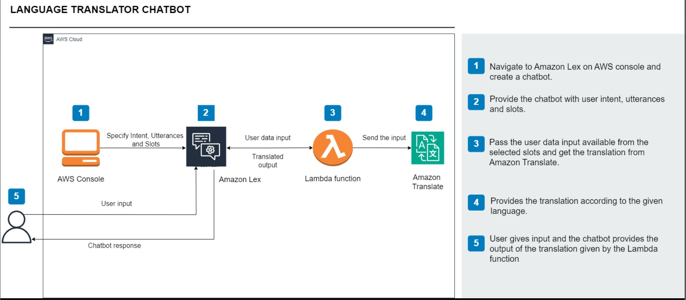

2. **Created a custom slot type** — Added a `Language` slot type with supported values.

   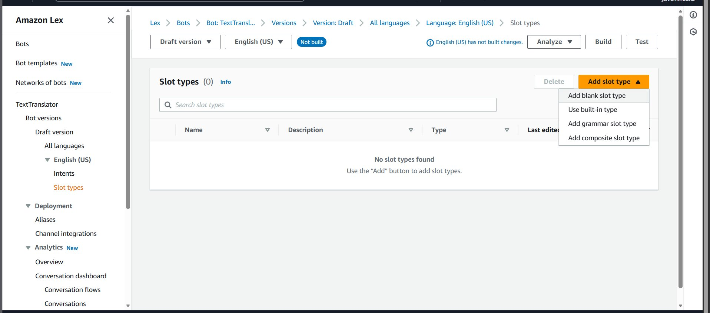

3. **Configured the intent and slots** — Created `TranslationIntent` with sample utterances and two slots: `language` and `text`.

   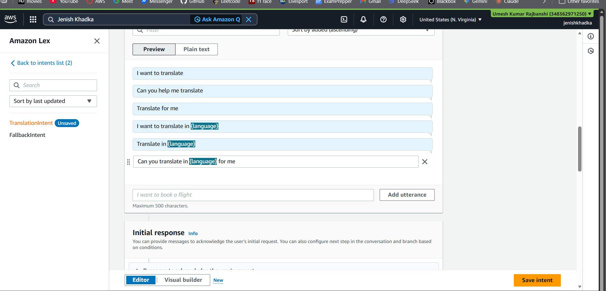
   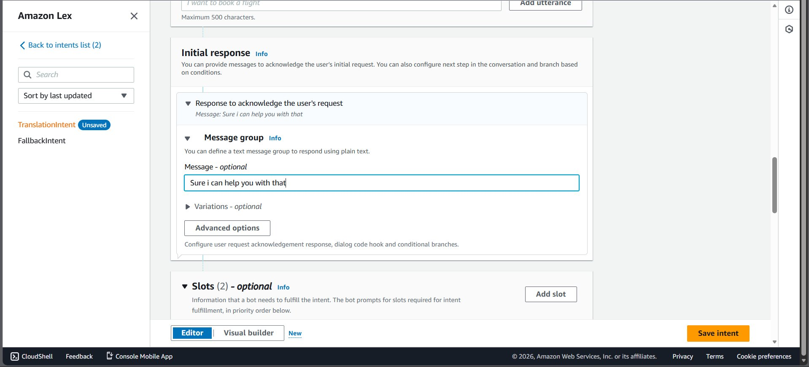

4. **Set fulfillment** — Enabled Lambda fulfillment via the Advanced options of the Fulfillment section.

   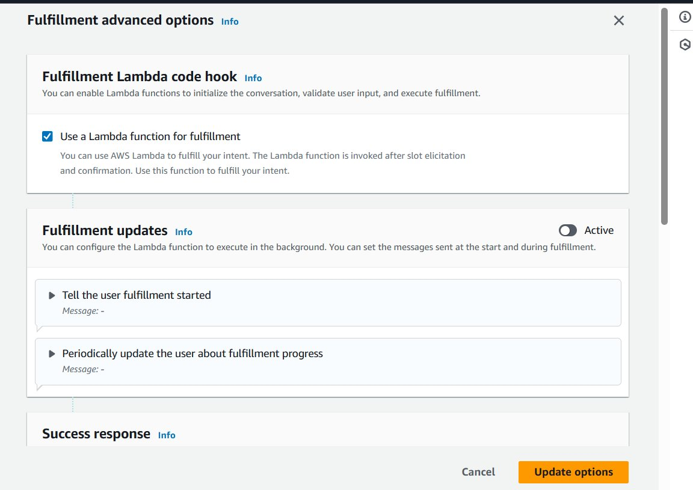

5. **Created IAM role** — Created `lambdabotrole` with `TranslateFullAccess` and `AWSLambdaBasicExecutionRole` policies.

   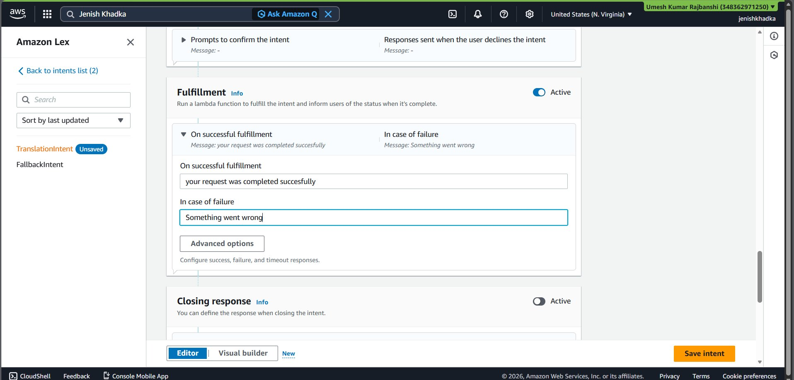

6. **Created Lambda function** — Created `TranslateBot` function using Python, attached `lambdabotrole`, and wrote translation logic.

   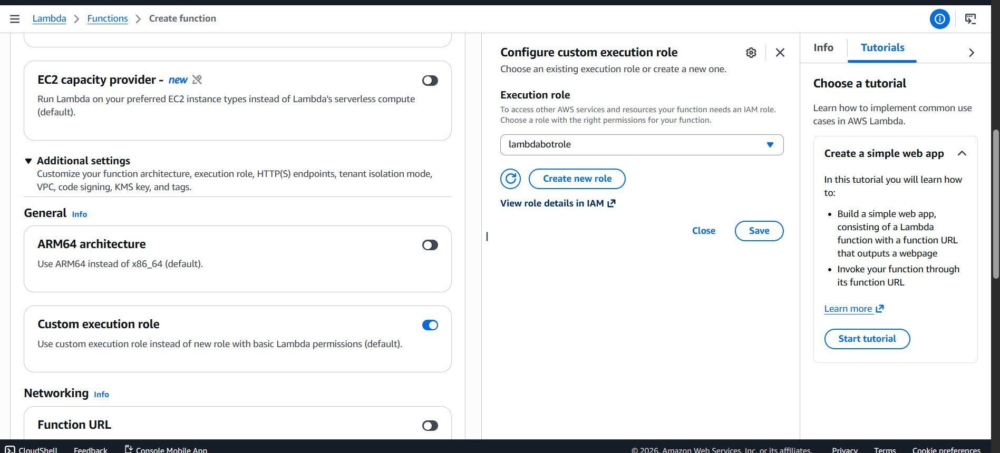

7. **Tested the Lambda function** — Used the following test event to verify the function returns the correct translation.

   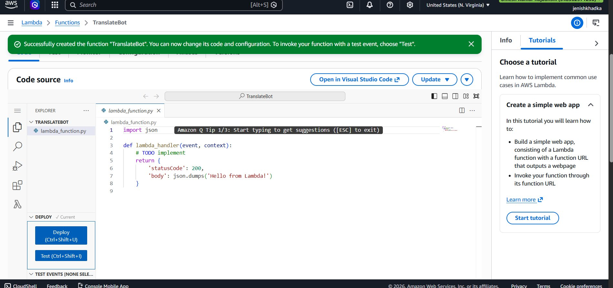
   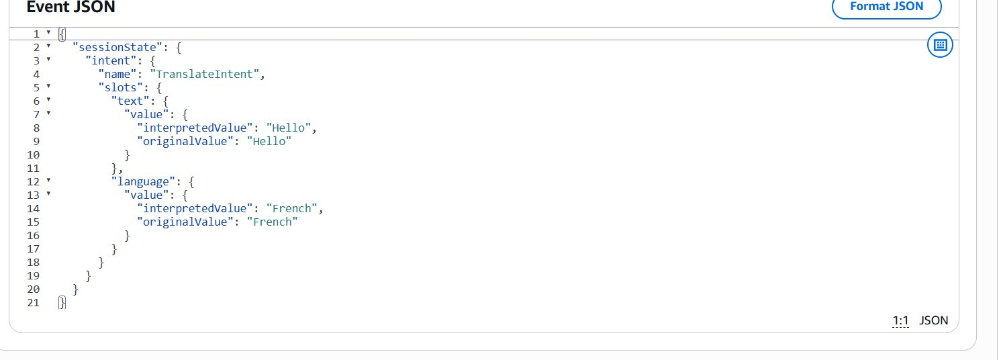

8. **Linked Lambda to Lex alias** — Attached `TranslateBot` (`$LATEST`) to the `TestBotAlias` under English (US) in the bot settings.

   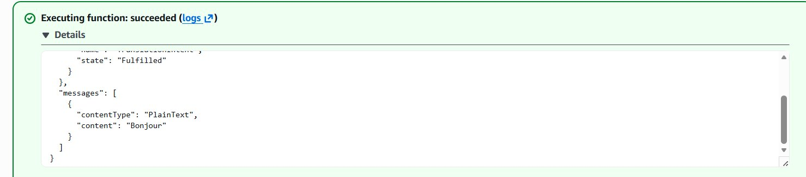

9. **Tested the chatbot** — Successfully tested the full flow in the Lex console.

   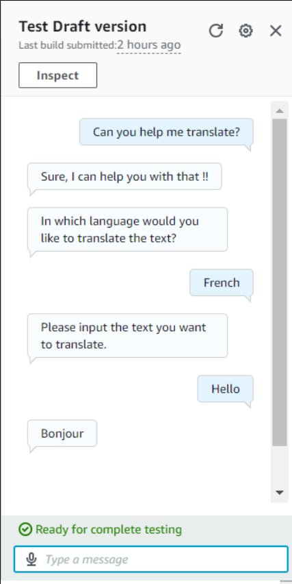

---

### Bot Configuration Details

**Intent name:** `TranslationIntent`

**Sample Utterances:**
```
I want to translate
Can you help me translate
Translate for me
I want to translate in {language}
Translate in {language}
Can you translate in {language} for me
```

**Slots:**

| Slot | Type | Prompt |
|------|------|--------|
| `language` | Language (custom) | In which language would you like to translate the text? |
| `text` | AMAZON.FreeFormInput | Please input the text you want to translate. |

**Supported Languages:** French, Japanese, Chinese, Spanish, German, Norwegian

---

### Lambda Test Event

```json
{
  "sessionState": {
    "intent": {
      "name": "TranslationIntent",
      "slots": {
        "text": {
          "value": {
            "interpretedValue": "Hello",
            "originalValue": "Hello"
          }
        },
        "language": {
          "value": {
            "interpretedValue": "French",
            "originalValue": "French"
          }
        }
      }
    }
  }
}
```

---

### Final Result


> User: "Hello" → Bot: "Bonjour" ✅

---

### Estimated Time & Cost ⚙️

* Time: ~1–2 Hours
* Cost: Free (within AWS Free Tier)

---

### Connect with Me 🌐

* GitHub: [your-github-link]
* LinkedIn: [your-linkedin-link]
